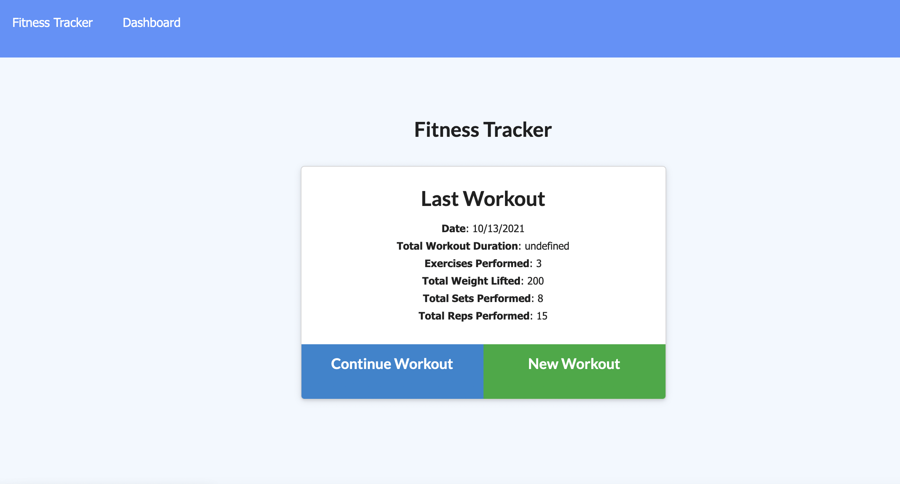
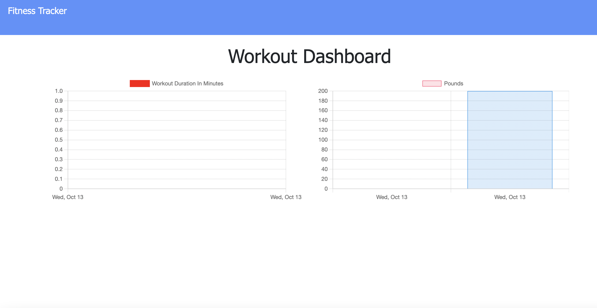

# Fitness-Tracker

## Objective
This app is a fitness tracker that allows users to log their workouts, both resistance and cardio, and provide exercise details like type, weight, sets, reps, and duration of the exercise.  The data the user logs is stored using Mongodb and the site is deployed using Heroku.

## Technologies and Tools Used
Heroku, Mongodb, Express, Javascript, CSS, HTML

## Links:
* Deployed Site: https://salty-wildwood-11707.herokuapp.com/
* Repo: https://github.com/evapopp/Fitness-Tracker

## Page Preview

## Creator
Eva Popp, Full Stack Developer
* Email: evapopp8@gmail.com
* Github: https://github.com/evapopp
